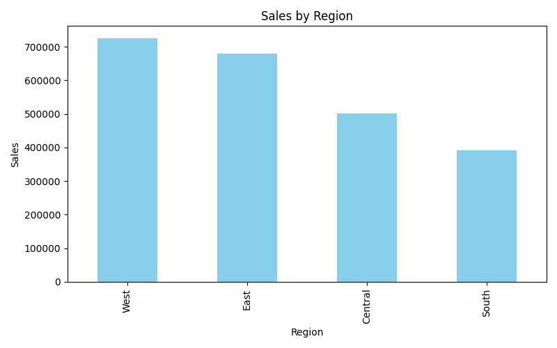
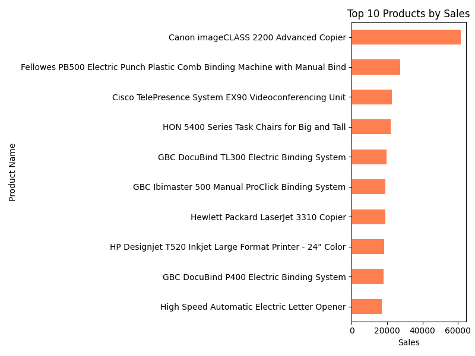
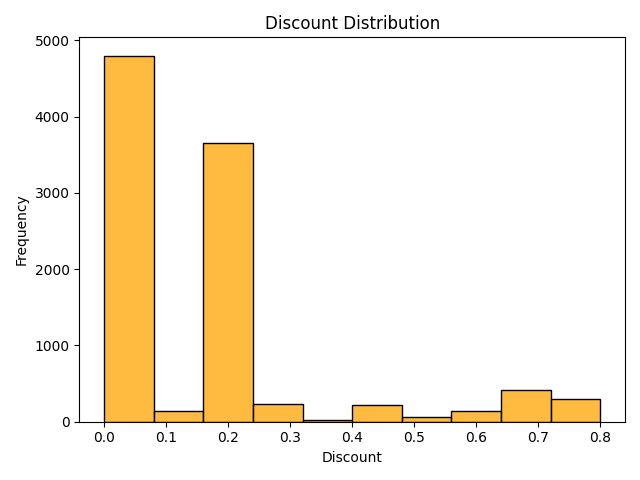

# Retail Sales Dashboard 📊

This project analyzes a retail sales dataset using Python (pandas, matplotlib, seaborn) to extract insights on product performance, regional sales, customer profitability and discount patterns.

---

## 🔍 Project Goals

- Understand sales distribution across products, customers and regions  
- Identify top-performing items  
- Analyze discount impact and profit fluctuations  
- Create visualizations for stakeholders

---

## 📁 Project Structure

retail-sales-dashboard/
├── sales_data.csv # Raw sales dataset
├── retail_sales.ipynb # Jupyter notebook with all analysis
├── charts/ # PNG visualizations generated by code
│ ├── sales_by_region.png
│ ├── top_10_products.png
│ └── discount_distribution.png
├── README.md # This file, the documentation

---

## 📈 Key Findings

- **Top Product:** Canon imageCLASS 2200 Advanced Copier (~$61K in sales)  
- **Most Profitable Region:** East  
- **Highest Profit Customer:** TC-20980  
- Discounts above **30%** often correlate with **negative profit**  
- South region shows high volume but lower profitability

---

## 🧰 Tools Used

- Python
- pandas
- matplotlib / seaborn
- Jupyter Notebook

---

## ✅ What This Project Demonstrates

- Exploratory data analysis (EDA)  
- Grouping, filtering, and aggregating data with pandas  
- Visualizing trends and distributions  
- Building insights for business decision-making

---

## 🗂️ Future Work

- Add monthly trend analysis  
- Build interactive dashboard (e.g. in Streamlit or Power BI)  
- Analyze customer lifetime value

## 📊 Visualizations

### 🗺️ Sales by Region

### 🛍️ Top 10 Products by Sales

### 💸 Discount Distribution

